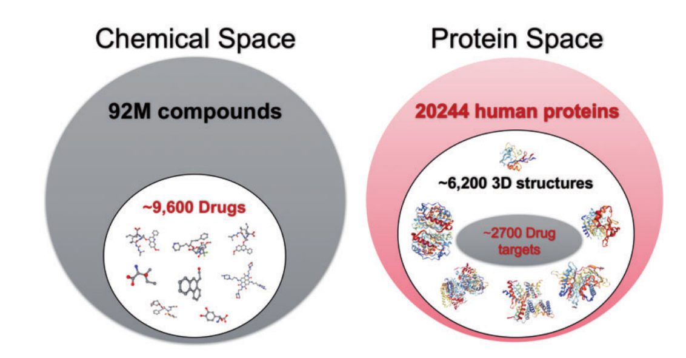
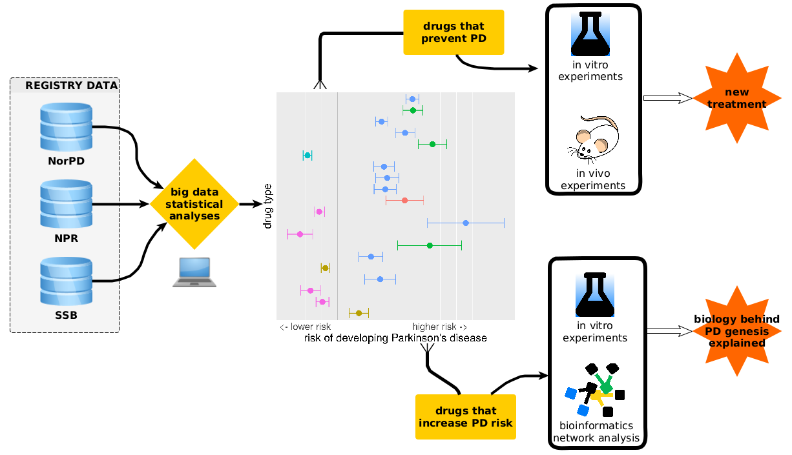

```{r setup, include=FALSE}
options(htmltools.dir.version = FALSE)
```

```{r xaringan-themer, include=FALSE, warning=FALSE}
library(xaringanthemer)
library(xaringanExtra)
style_duo_accent(
  primary_color = "#1381B0",
  secondary_color = "#FF961C",
  inverse_header_color = "#FFFFFF"
)
xaringanExtra::use_logo(
  image_url = "drone_logo_sm.png"
)
xaringanExtra::use_clipboard()
xaringanExtra::use_fit_screen()
```

class: inverse, center, middle

background-image: url(drone_logo_sm.png)
background-size: contain

# DIVING INTO REGISTRY DATA

### using R for large-scale data analyses on Norwegian health registries

#### Julia Romanowska

UiB, IGS

???

- Traditional drug design
- Unique position of Norway
- New drug design paradigm
- DRONE project
    - Data
    - Workflow
    - Methods (in R)
    - Example

---

## Drug design: research question



<p style="font-size: small; font-style: italic;">
src: [Rifaioglu, et al. (2019). Briefings in Bioinformatics, 20(5), 1878–1912.](https://doi.org/10.1093/bib/bby061)
</p>

???

Drug design - how is it actually formulated as a basic research question?
In a way it's a jigsaw puzzle - we have an enzyme, a protein inside our body
that needs to be fixed with a certain compound, a drug. So we need to
design this compound so that it fits the protein as good as possible.

But, there's more - we don't really know which protein we need to focus on
and it's estimated that we have more than 20k proteins. On top of that, if we
assume that we can build a compound from scratch in any way, there can be 
almost 100mln possibilities! Thankfully, not all of those can be used as a
drug - we exclude some automatically based on e.g., their toxicity or
insolubility, but up to date there are almost 10k compounds classified
as drugs.

---

background-image: url(diver_old.jpg)
background-size: 60%
background-position: right

## Traditional drug design

1. _Basic research:_    
find the protein to target

2. _Computational drug design:_    
find the best drug __candidates__

3. _Experimental research:_    
check the candidates __in vitro__ and __in vivo__

4. _Clinical trials:_    
3 phases before accepting + phase 4

--

**Disadvantages:**

- very long time
- billions of dollars
- 88% of candidate drugs fail

???

So many drugs are already on the market, so we need to use this data!
That's were the registries come in handy...

---

background-image: url(juanma-clemente-alloza-_k82HQ1OBoM-unsplash.jpg)
background-size: 60%
background-position: top right
class: left, bottom


## New paradigm:
### drug repurposing

- virtual clinical tests - _Norwegian registry data_
- experimental confirmation in animal models
- explore the drug targets    
and similar drugs

<span style="right: 20px; font-size: small;">Photo by <a href="https://unsplash.com/@juanmacllas?utm_source=unsplash&amp;utm_medium=referral&amp;utm_content=creditCopyText">Juanma Clemente-Alloza</a> on <a href="https://unsplash.com/?utm_source=unsplash&amp;utm_medium=referral&amp;utm_content=creditCopyText">Unsplash</a></span>

???

- __drug repurposing__
- no rejection due to unknown side-effects
- many virtual confirmation tests can be done
- confirmation of molecular action in animal models

- registry-based epidemiology:

  - no bias
  - translational design
  - agnostic search

---

class: left, top

## DRONE =
### Drug Repurposing
### fOr NEurological diseases

- entire prescription registry of Norway

  - `>`670 mln prescriptions    
  (4.6 mln Norwegians, 2004 - 2019)
  - `>`1800 various drugs
  - size in the memory: 105 GB

- Norwegian patient registry

- Statistics Norway (SSB)

???

- _Neurological diseases:_ PD, MS, ALS

---

## Workflow



<br>
<small>
preliminary test was published in [Mittal, S., *et al.*, **(2017)**. Science, 357(6354), 891–898.](https://doi.org/10.1126/science.aaf3934)
</small>

---

## Methods & techniques

- *internal* R-package to ease access to data
    - `usethis` 
    - custom templates for Rmarkdown reports
    - `RSQLite` and `dbplyr` 

--

- data visualization: *passive* and *interactive*
    - `ggplot2` 
    - `flexdashboard` 
    - `plotly` 
    - `crosstalk`

--

- reporting in Rmarkdown

- presentations
    - `xaringan`  & co

---

## Exemplary results

### Analysis type:

- Cox-regression
- exposure: *min. 2 prescriptions of a drug*
- outcome:    
*PD diagnosis* defined as *min. 4 prescriptions of levodopa*
- study population:    
*entire population of Norway on 01-01-2015*
- dataset:    
*entire Prescription Registry* (all the prescriptions in entire Norway between 01-01-2014 and 31-12-2019)

???

Show them: file:///home/jro049/REPOS/DRONE-Norway-USA/vis_results/show_results_plotly_2prescr_PD-4prescr-levo.html
and time-lag: file:///home/jro049/REPOS/DRONE-Norway-USA/vis_results/interpretation_results_Cox_regr_compare_orig-analysis_vs_time-lag_all.html

---

background-image: url(DRONE_ppl.png)
background-size: 60%
background-position: top right

## The divers

<p style="bottom: 20px; font-size: small;"><a href="http://link.uib.no/DRONE">DRONE webpage @ UiB</a></p>

